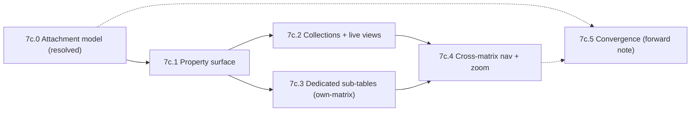

# Phase 7c -- Row–table continuum (design exploration)

> **Status: exploration complete; promoted into implementation phases.** This document is the original design exploration. Its conceptual model (the data/view split and the one-attachment-primitive-with-presets) still stands and is preserved below. Its **data-layer storage mechanism was subsequently revised** by an ownership-centric iteration (recorded in the root working docs `PHASE-7C-PRIMER.md` and `Phase 7c data layer resolution.md`); the revised model -- `own` as the universal tree edge, rank-on-edge, derived closure/scroll index, `matrix.owner`, tags-as-nodes -- is implemented in **[Phase 8](Phase-8.md)/[8b](Phase-8b.md)/[8c](Phase-8c.md)** (the data layer). The **view-layer sub-phases sketched in §5 (7c.1–7c.5) moved to [Phase 9](Phase-9.md)**. The design-system pass that follows is **[Phase 10](Phase-10.md)** (formerly Phase 7d). Read §3–§4 here for the conceptual frame; read the resolution doc and Phases 8–9 for the current truth.

A design-exploration phase, not a feature build. The goal is to feel out the fluid continuum between the **outline paradigm** and the **table paradigm** -- the long-standing vision of structured, spreadsheet-like data and queries integrated naturally with outlining and note-taking -- and to land a coherent conceptual model and a sequence of focused follow-on sessions before any implementation.

This is the row/table analog of the breadcrumb/navigation deep dives in [Phase 7](Phase-7.md) and [Phase 7b](Phase-7b.md). Like the original 7c (now the design-system pass in [Phase 10](Phase-10.md)), it front-loads decisions: the early output is documentation and resolved decisions, not code.

Background: [Architecture.md](Architecture.md) (cross-face data sharing, hydration, join kinds, identity face), [Plugins.md](Plugins.md) (face slot model, tags plugin), [Traits.md](Traits.md) (rank, closure, join `ref`/`own`), and the implemented stream view (`src/workspace/StreamView.tsx`, `NavigationPanel.tsx`, `FocusPanel.tsx`) and table face (`src/table/TableFace.tsx`).

---

## 1. The vision and why now

The app aims to unify outlining, document authoring, and a personal database of spreadsheets so that the same data is viewable through different faces -- "a bullet IS a note if you zoom in far enough," and equally, a cluster of bullets IS a table if you give it columns. Phase 7 delivered the outline↔document axis (the stream view: every row has a `label` bullet and a `content` document). This phase explores the **outline↔table axis**: how structured, queryable, spreadsheet-like data lives inside and alongside the outline.

The pieces are partly in place but disconnected, which makes now the right time to design the connections deliberately rather than accreting them feature-by-feature.

## 2. Current-state audit

What exists today, and what is only stubbed:

- **Child-matrix references are stubbed.** `row_kind = 1` exists in the `rank` schema (`src/core/matrix.ts`: `0=row, 1=child_matrix_ref`, where `row_id` then holds the child matrix's id), but **nothing creates one**, and `FocusPanel` only renders a placeholder string ("Child matrix reference (row_kind=1). Table face would render here.").
- **The workspace matrix is homogeneous.** It has `label` + `content` only. Extra columns render as a flat "Properties" list **only** in the focus panel (the `FocusPanel` overflow section via `FieldEditor`); navigation rows show no property preview.
- **The table face is full-featured but isolated.** `TableFace.tsx` supports typed columns (text/number/date/boolean/select/reference), sort, filter, formula columns, and reference cells -- but it is **never embedded** inside the stream view, and the "live embedded query face" workflows described in `Architecture.md` are unimplemented.
- **The stream view assumes a single matrix.** The overlaid-cards ancestry/breadcrumb model in `StreamView.tsx` walks one matrix's closure; crossing into a child matrix is not handled.
- **Three overlapping pre-existing ways to add structure:** intrinsic columns (matrix-wide), `#tag` aspect rows (an `own`-join to a row in a tag-type matrix), and child-matrix references (a row that is a whole matrix). Reconciling these is the heart of this phase.

## 3. Settled model: two layers

The foundational decision, settled in dialogue: separate **how structure is stored** from **how structure is seen**.

- **Data layer -- how structure is *stored*.** Everything is rows in matrixes. A row carries structure in its own columns, or attaches structure stored in another matrix (see the attachment model in §4).
- **View layer -- how structure is *seen*.** Faces over a matrix or a query. **Outline and table are faces, not data kinds.** The continuum is, in large part, a view-layer phenomenon: face-swap (outline↔table↔board), zoom (bullet↔document), and embed (a face rendered inside a focus panel or content).

**Thesis:** "homogeneous vs heterogeneous" is a *storage* distinction; "outline vs table" is a *viewing* distinction; they are orthogonal and composable. That orthogonality is the heart of the continuum. A subtree of homogeneous rows can be shown as an outline or a table; a heterogeneous pile of nodes can still be queried into a table view.

A load-bearing realization: **a tag-type matrix IS a database of records.** The `#task` matrix is literally a Tasks table; each aspect row is a record; the `own` join is that record's link to its host node. "View all my tasks as a table" is just the table face over the `#task` matrix, optionally filtered. There is no separate "Tasks database" to invent.

## 4. Section 7c.0 -- The conceptual model (landed)

This is the foundational sub-phase. It is resolved here; everything downstream builds on it.

### 4.1 The attachment primitive

A node has one identity (its row, `(matrix_id, row_id)`). A node's structure is its **intrinsic row** plus a set of **attachments**. An attachment binds the node to a set of rows in some matrix, via a **binding**:

- **own-rows** -- the node owns specific rows in a (possibly shared) matrix, via `own`-joins. Lifecycle: deleting the node or removing the attachment cascade-deletes those rows. This is exactly today's `#tag` / `createDependentRow` mechanism.
- **own-matrix** -- the node owns an entire dedicated matrix (its rows exist for and under this node). Lifecycle: cascade the whole matrix. This is the `row_kind = 1` child-matrix reference, made real.
- **query** -- the node references rows matching a predicate (often node-scoped, e.g. "tasks whose host is in this subtree"). No lifecycle; purely a `ref`-style computed view.

**Ownership falls out of the binding kind** (own-rows / own-matrix are owned; query is referenced), so it is not a separate flag the user juggles.

### 4.2 Resolution of open question 1 -- cardinality is not the axis

Cardinality (0/1 vs 0..N) is **not** the distinction between aspects and collections, and is not constrained to 0/1.

- The single-ownership invariant is **per target row** -- each row has at most one owner -- and it holds at any cardinality. A node owning several rows in a shared matrix does not violate it.
- So **0..N facets are allowed.** The real, meaningful axis (the user's reframe) is **ownership granularity**: own-rows (specific rows in a shared matrix) vs own-matrix (a dedicated matrix). "Something else always owns the full matrix for aspects" is exactly right -- a tag-type matrix is shared infrastructure; a node owns only *its rows* within it.
- The familiar "this node *is* a task" case is simply an own-rows attachment at cardinality 1, displayed as **merged inline fields** on the node. "Many tasks under this node" is the same binding at cardinality N, displayed as a **collection**. We therefore drop the hard 0/1 rule from the earlier recommendation: singleton-ness is a per-attachment **display/constraint choice**, not a law of the model.

### 4.3 Resolution of open question 2 -- one primitive, a few presets

We do **not** need three separate data mechanisms. The trichotomy (aspect / hosted collection / query view) collapses into **one parametric primitive -- the attachment -- with three named presets at the UX layer**:

| Preset (UX gesture) | Binding | Typical cardinality | Default display |
|---|---|---|---|
| **Tag** ("this is a …") | own-rows | 0/1 | merged inline fields (property surface) |
| **Collection / sub-table** | own-rows (shared) or own-matrix (dedicated) | 0..N | a face (table / outline / board) |
| **Live view** | query | 0..N | a face, read-through (editable where hydrated) |

- **Theoretically:** an attachment is `(node) -> set of rows R in matrix M`, where `R` is fixed by a selector -- `own` (the rows the node owns; cascades) or `query(predicate)` (the rows matching a predicate; no lifecycle) -- and `own` has a *granularity* (specific rows vs a whole dedicated matrix). Ownership and lifecycle are derived, not declared. This pseudo-formalization stays intuitive: "a node points at some rows, and either it made them (owns them) or it merely found them (queries them)."
- **Practically:** users do not think in parameters; they think "tag this," "put a table here," "show me everything matching X here." So the architecture is **one mechanism** (joins/queries + faces -- great for the op layer, sync, and MCP), while the UX exposes a **small set of comprehensible gestures**, with a general/configurable form available for power use. This is the "single structure that is both flexible and comprehensible" we were after.

### 4.4 Where intrinsic columns fit

Intrinsic columns are the **base case**: structure stored in the node's own row. A node's **property surface** = its intrinsic columns ∪ the fields of its 0/1 owned attachments (tags shown as merged fields). This is what the property-list view renders (§5, 7c.1).

Consequence retained from the dialogue: **the workspace ("everything") matrix should not grow user-domain columns** (columns are matrix-wide, so a "priority" column would attach to every bullet). Domain structure goes through attachments. Therefore **"promote a subtree to a table" is a real matrix migration** (create a dedicated matrix via an own-matrix attachment and move/reference the rows), not a free in-place face-swap. Intrinsic columns are first-class for purpose-built matrixes (the dedicated tables themselves), and reserved-to-minimal (label/content + perhaps universal system metadata) on the workspace matrix.

### 4.5 Elemental interactions (sketched)

- **Add a field to a node:** attach a tag (own-rows @ 0/1) whose fields appear inline; or, on a purpose-built matrix, add an intrinsic column.
- **Show a node's owned records here:** an own-rows @ 0..N or own-matrix attachment rendered via a chosen face.
- **Embed a live view here:** a query attachment (e.g. "all `#task`s in this subtree").
- **Make a row a sub-table:** create an own-matrix attachment (the `row_kind = 1` path) and pick a face.
- **Swap how a collection looks:** change the attachment's face (table ↔ outline ↔ board) without touching data.

### 4.6 Sub-questions deferred to later sub-phases

- **own-matrix representation.** How is "this node owns matrix M" stored and cascaded -- the `row_kind = 1` ref plus an ownership convention, a `matrix.owner` field, or a join to the matrix's identity? (→ 7c.3)
- **node-scoped query authoring + editable-in-place hydration** for query attachments. (→ 7c.2)
- **cross-matrix ancestry/breadcrumbs and drilling** in the overlaid-cards model. (→ 7c.4)
- **own-rows @ 0..N (scoped collection over a shared matrix) vs own-matrix (dedicated):** do these feel different enough to warrant distinct gestures, or do they unify in the UX? (revisit in 7c.2 / 7c.3)

## 5. Reshaped sub-phase sequence

> **Where this went:** 7c.0 (the data/storage model) was carried further by the ownership-centric resolution and is now implemented in [Phase 8](Phase-8.md)/[8b](Phase-8b.md)/[8c](Phase-8c.md). The view-layer sub-phases below (7c.1–7c.5) moved to [Phase 9](Phase-9.md) (mapped there as 9.1–9.7). The sketches below are retained as the original framing.

Ordered from most foundational/transferable to hardest. The sequence was reshaped by the 7c.0 resolution (the trichotomy is now presets of one primitive, so the sub-phases are "which binding/display we make real next").

- **7c.0 -- The attachment model.** (Resolved above.) The data/view split and the attachment primitive with its presets. Gates everything.
- **7c.1 -- The property surface.** Intrinsic columns + 0/1 owned attachments rendered as inline fields. A consistent property list in the focus panel and a compact preview in navigation rows; the add/edit gesture; coexistence of intrinsic columns and tag fields. Builds directly on the existing overflow-column list, `FieldEditor`, and tag chips. Most tangible; informs and is informed by the tasks/movie-reviews work ([Phase 11](Phase-11.md)). (→ [Phase 9 §9.2](Phase-9.md).)
- **7c.2 -- Collections & live views.** Render a row-set under a node as an embedded face: own-rows @ 0..N (owned collections) and query bindings (live views). Node-scoped query authoring; editable-in-place hydration (Notion-linked-database style). Chosen first among the "collection" presets because it serves the daily task/review cases and needs no new ownership machinery.
- **7c.3 -- Dedicated sub-tables (own-matrix).** Realize the `row_kind = 1` child-matrix reference: a creation op, matrix-level ownership/lifecycle, the embedded `TableFace`, a navigation-panel collapsed preview, and outline interactions around a sub-table row.
- **7c.4 -- Crossing matrix boundaries.** Drill into an attached/record row as a focus panel; generalize the overlaid-cards ancestry/breadcrumb model across matrix boundaries; the panel-stack state machine. The hardest, since it touches the stream view's core state.
- **7c.5 -- Paradigm convergence (forward-looking).** Table face with hierarchy; outline with a table/column view; face-swapping a subtree between outline and table. Largely a forward note: capture decisions that fall out of 7c.1–7c.4 and leave the remainder as a documented direction.

Each sub-phase is expected to get its own deeper session (and may spawn its own doc, as 7b followed 7) when tackled.

## 6. Coordination with the tasks phase and deferred questions

> Phase numbering note: at the time of writing, "Phase 8" meant tasks/movie-reviews. That work is now [Phase 11](Phase-11.md); the new Phase 8 is the data-layer ownership spine. The text below is updated to the current numbering.

- **The tasks phase is the same mechanism.** [Phase 11](Phase-11.md)'s `#task` / `#movie-review` aspect rows via `createDependentRow` **are** the own-rows binding; their identity faces are table faces over the tag-type matrix. The renderer registry, tag templates, and tag property panel that Phase 11 builds are the **rendering substrate** for the property surface ([Phase 9 §9.2](Phase-9.md)). The property surface (design) and Phase 11 (implementation) are complementary; sequence them flexibly, but design the property surface so the Phase 11 renderer registry and property panel can realize it directly.
- **Reframes Plan.md open question 3 (singleton tags).** With cardinality freed (§4.2), the `#`-tag-as-singleton question becomes: own-rows binding (a new owned aspect) vs `@`-ref (a `ref` to an existing entity). The model now expresses both cleanly.
- **Touches Plan.md open question 4 (labeled/typed joins).** Query and own-rows attachments would benefit from labeled joins for richer reverse lookups ("appears as Author in…"). Note as a dependency, resolve if/when 7c.2 needs it.
- **Touches Plan.md open question 5 (face affinity).** Which face a child matrix renders in (7c.3) is the face-affinity question; the attachment can carry a preferred face.

## 7. Dependency notes

Follows [Phase 7b](Phase-7b.md). This exploration was promoted into implementation: its data layer is [Phase 8](Phase-8.md)/[8b](Phase-8b.md)/[8c](Phase-8c.md), its view layer is [Phase 9](Phase-9.md), and the design-system pass that follows is [Phase 10](Phase-10.md) (best done once Phases 8–9's new surfaces -- property surface, embedded collections, live views, sub-tables, cross-matrix navigation -- are settled so the token/theming system spans the final set). Within the original framing, 7c.0 gated all sub-phases; 7c.1 preceded 7c.2 and 7c.3; 7c.4 depended on 7c.2/7c.3; 7c.5 was a forward note (now Phase 9 §9.1–9.7). The work is coordinated with the tasks/movie-reviews phase ([Phase 11](Phase-11.md), §6).
