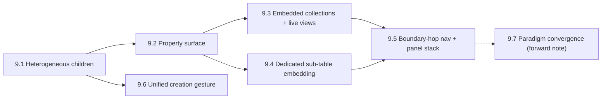

# Phase 9 -- View layer: rendering the row–table continuum

> The view-layer half of the row↔table continuum. [Phase 7c](Phase-7c.md) was the design exploration; its **data-layer** questions were resolved and are implemented in [Phase 8](Phase-8.md)/[8b](Phase-8b.md)/[8c](Phase-8c.md) (the ownership spine). This phase carries the **rendering & interaction** work that the data resolution explicitly handed off -- it is the union of 7c's original view-layer sub-phases (7c.1–7c.5) and the resolution's §4 hand-off. The design-system pass that unifies tokens/theming across these surfaces is [Phase 10](Phase-10.md).

Foundation to honor (from the ownership resolution, do not relitigate without cause): the §1 ownership spine and §2 data decisions are settled in Phase 8. Development principles unchanged -- **incremental/intentional** (don't over-build), **gestalt-aware** (architecture/code/docs coherent), **performance** (<50ms, single-frame feel). Keep **orthogonality with [Phase 11](Phase-11.md)**: the property surface must be realizable by the tasks/movie-reviews renderer registry and tag property panel.

The tell that motivated promoting this to its own phase: once the data layer closed, **every remaining continuum question had migrated into rendering & interaction.** They are sequenced below from most foundational/tangible to hardest.

Each sub-phase may get its own deeper session and spawn its own doc when tackled, as the deep dives did under Phase 7.

---

## 9.1 Heterogeneous children in one outline

A node's `own`-children can span multiple matrixes (bullets + `#task` rows + a `#note` + …), interleaved in one sibling order carried on the `own`-edges (Phase 8 §3, the scroll index in Phase 8b §2). This sub-phase makes that render.

- How do heterogeneous children render together in a single ordered outline, and how does each row *type* present in a navigation row (a plain bullet vs an aspect row vs an embedded-collection marker)?
- **Perf:** scroll order stays a single-column keyset range scan on the derived pre-order index (Phase 8b §2), so windowing is unchanged. The genuinely new hot-path cost is that a window yields `(matrix_id, row_id)` pairs **spanning matrixes**, so hydrating the ~500 visible rows is a **multi-table gather** rather than one `SELECT *`. Batch by matrix, lazy-load, virtualize against the <50ms target.
- Touches `src/workspace/NavigationPanel.tsx`, `src/sql/useQuery.ts`, the join/edge query + the Phase 8b scroll index.

## 9.2 The property surface (most tangible)

Intrinsic columns ∪ 0/1 owned aspect fields rendered as inline fields: a consistent property list in the focus panel and a **compact preview in navigation rows**; the add/edit gesture; coexistence of intrinsic columns and tag fields.

- A node's **property surface** = its intrinsic columns (its own row) ∪ the hydrated fields of its 0/1 owned aspect attachments (tags shown as merged inline fields). The `own`-edge supplies lifecycle; hydrated columns supply editability.
- Builds directly on the existing focus-panel overflow "Properties" list, `src/shared/FieldEditor.tsx`, and the tag badge chips.
- **Design it so [Phase 11](Phase-11.md)'s renderer registry / tag property panel realize it directly** -- 9.2 (design + workspace integration) and Phase 11 (renderer registry, templates, custom cell renderers) are complementary; sequence them flexibly.
- Touches `src/workspace/FocusPanel.tsx`, `src/workspace/NavigationPanel.tsx`, `FieldEditor.tsx`, `src/tags/*`.

## 9.3 Embedded collections & live views

Render a row-set under a node as an embedded face (table / outline / board): **owned collections** (`own`-edges @ 0..N) and **query bindings** (live views).

- **Node-scoped query authoring UX:** express "tasks whose host is in this subtree" without writing SQL -- closure (Phase 8b) gives "in this subtree," the `own`-edge into the type's matrix gives "is a task." Design the authoring affordance.
- **Editable-in-place write-back** via hydration, with **insertion target = the node** (a node-scoped query has an obvious place to insert new rows). Notion-linked-database-style.
- The embedded face is the isolated `TableFace` (and later outline/board) finally embedded inside the stream view -- the "live embedded query face" workflow from `Architecture.md`.
- Touches `src/table/TableFace.tsx`, `src/core/FaceRenderer.tsx`, `useQuery.ts`.

## 9.4 Dedicated sub-table embedding

The embedded `TableFace` inside the stream view for an own-matrix (Phase 8c §2); a collapsed preview in the navigation panel; outline interactions around a sub-table row.

- **Open, data-adjacent item -- reinterpret the old `row_kind = 1` stub.** Ownership is already fully expressed by `own`-edges + `matrix.owner` (Phase 8/8c), so the old `rank.row_kind = 1` "child matrix reference" should be reinterpreted as a **view-layer positioning marker**: it carries **position among a node's heterogeneous children, not ownership.** Settle its exact shape here (where the embedded face sits among siblings, how it's stored as a positioning marker rather than on the dissolved `rank` table).
- The `FocusPanel` placeholder (the old "Child matrix reference (row_kind=1). Table face would render here." string) is replaced by the real embedded face.
- Touches the former `rank`/`row_kind` concept (now an edge/position marker, see Phase 8 §5), `src/workspace/FocusPanel.tsx`.

## 9.5 Boundary-hop rendering & the panel stack (hardest)

The data is trivial now (ancestry = the `own`-chain across boundaries, Phase 8), so the work is purely view-layer.

- Generalize the overlaid-cards / panel-stack model so a panel is keyed by **`(matrix_id, row_id)`** rather than a single matrix's row id.
- Render a **boundary hop**: a `#task` aspect row whose `own`-parent is a host bullet in another matrix, shown in one continuous ancestry chain.
- Decide **what face shows on the far side** when you drill into an aspect/record row. This is `Plan.md` open question #5 (**face affinity**) -- an attachment / matrix may carry a preferred face. Resolve #5 here.
- Touches `src/workspace/StreamView.tsx` panel-stack state, `src/design/overlaid-cards/OverlaidCards.tsx`, the breadcrumb/ancestry data.

## 9.6 The unified creation gesture

One "add a collection / make this a …" gesture with a single knob: **existing shared type** (`own`-rows in that matrix) vs **new dedicated matrix** (own-matrix). Mirrors Notion's "link database" vs "new inline database."

- Where it lives, its defaults, and how the promotion taxonomy (Phase 8c §6) surfaces inline (e.g. promoting a label to a type, a shared collection to a dedicated sub-table).
- Data paths exist after Phase 8c (own-matrix creation op, promotion ops); this is their UX surface.

## 9.7 Paradigm convergence (forward note)

Largely a documented direction once 9.1–9.5 land:

- Table face with **hierarchy** (it can now render an `own`-forest directly).
- Outline with a **column view**.
- Face-swapping a subtree between outline and table without touching data.

Capture decisions that fall out of 9.1–9.6 and leave the remainder as a documented direction for a later phase.

---

## Done criteria

Heterogeneous cross-matrix children render in one ordered, virtualized outline within the <50ms budget (multi-table gather handled). The property surface renders intrinsic columns ∪ owned aspect fields consistently in focus panels and as compact navigation-row previews, realizable by the Phase 11 renderer registry. Embedded collections and live (query-bound) views render inside the stream view with node-scoped authoring and editable-in-place write-back. Dedicated sub-tables embed via the table face with the `row_kind`-as-position-marker settled. The panel stack is keyed by `(matrix_id, row_id)` and renders boundary hops, with face affinity (`Plan.md` #5) resolved. The unified creation gesture exists. Convergence is captured as a forward note. Static analysis and the workspace/table E2E suites pass throughout.

## Dependency notes

Depends on the data-layer ownership spine ([Phase 8](Phase-8.md) → [8b](Phase-8b.md) → [8c](Phase-8c.md)); each surface here consumes specific data facts settled there (edges, global closure/scroll index, `matrix.owner`, type-nodes). Complementary to [Phase 11](Phase-11.md) (tasks/movie-reviews) -- the property surface (9.2) and the renderer registry must compose. Precedes and feeds [Phase 10](Phase-10.md), the design-system / theming pass, which is best done once these surfaces are settled so the token system spans the final set. Resolves `Plan.md` open question #5 (face affinity) in 9.5.
