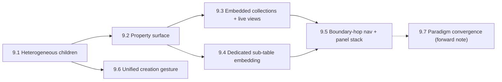

# Phase 9 -- View layer: rendering the row–table continuum

> The view-layer half of the row↔table continuum. [Phase 7c](Phase-7c.md) was the design exploration; its **data-layer** questions were resolved and are implemented in [Phase 8](Phase-8.md)/[8b](Phase-8b.md)/[8c](Phase-8c.md) (the ownership spine). This phase carries the **rendering & interaction** work that the data resolution explicitly handed off -- it is the union of 7c's original view-layer sub-phases (7c.1–7c.5) and the resolution's §4 hand-off. The design-system pass that unifies tokens/theming across these surfaces is [Phase 10](Phase-10.md).

Foundation to honor (from the ownership resolution, do not relitigate without cause): the §1 ownership spine and §2 data decisions are settled in Phase 8. Development principles unchanged -- **incremental/intentional** (don't over-build), **gestalt-aware** (architecture/code/docs coherent), **performance** (<50ms, single-frame feel). Keep **orthogonality with [Phase 11](Phase-11.md)**: the property surface must be realizable by the tasks/movie-reviews renderer registry and tag property panel.

The tell that motivated promoting this to its own phase: once the data layer closed, **every remaining continuum question had migrated into rendering & interaction.** They are sequenced below from most foundational/tangible to hardest.

```mermaid
graph LR
  hetero["9.1 Heterogeneous children"] --> prop["9.2 Property surface"]
  prop --> coll["9.3 Embedded collections + live views"]
  prop --> subtable["9.4 Dedicated sub-table embedding"]
  coll --> boundary["9.5 Boundary-hop nav + panel stack"]
  subtable --> boundary
  hetero --> create["9.6 Unified creation gesture"]
  boundary -.-> conv["9.7 Paradigm convergence (forward note)"]
```

Each sub-phase may get its own deeper session and spawn its own doc when tackled, as the deep dives did under Phase 7.

---

## 9.1 Heterogeneous children in one outline

A node's `own`-children can span multiple matrixes (bullets + `#task` rows + a `#note` + …), interleaved in one sibling order carried on the `own`-edges (Phase 8 §3, the scroll index in Phase 8b §2). This sub-phase makes that render. In the [Phase 9.2](Phase-9.2.md) model this is a **meshed band** with the outline face; meshing is gated by anchoring (only owned, anchored rows can interleave into the focal node's order).

- How do heterogeneous children render together in a single ordered outline, and how does each row *type* present in a navigation row (a plain bullet vs an aspect row vs an embedded-collection marker)?
- **Perf:** scroll order stays a single-column keyset range scan on the derived pre-order index (Phase 8b §2), so windowing is unchanged. The genuinely new hot-path cost is that a window yields `(matrix_id, row_id)` pairs **spanning matrixes**, so hydrating the ~500 visible rows is a **multi-table gather** rather than one `SELECT *`. Batch by matrix, lazy-load, virtualize against the <50ms target.
- Touches `src/workspace/NavigationPanel.tsx`, `src/sql/useQuery.ts`, the join/edge query + the Phase 8b scroll index.

## 9.2 The property surface (most tangible)

> **Deep-dive: [Phase 9.2](Phase-9.2.md).** A design session generalized this sub-phase: the property surface is one point on a broader model of **bands** (related row-sets around a focal node), an **anchoring** data axis, an **integration continuum** (merged / banded / meshed), a shared **schema-adaptive row renderer**, and a **composed vs. substrate** fidelity axis. The model unifies 9.2 with 9.1/9.3/9.4/9.5. The summary below reflects it; Phase-9.2.md has the full reasoning.

A node's **property surface** = its intrinsic columns (its own row) ∪ the hydrated fields of its owned aspect attachments. This is the **merged** integration level (a presentational left-join `host ⋈ aspect` on the `own`-edge); the `own`-edge supplies lifecycle, hydrated columns supply editability. (Cardinality is dropped as a distinction — see Phase-9.2.md.) Owned aspects that are *not* merged render as an **aspect band** above the children nav panel, through the shared schema-adaptive renderer.

- **Anchoring drives the visuals.** A content-anchored aspect (an `own`-join materialized from an inline `#`-ref in prose) is tethered to its token when banded/meshed; a structurally-anchored edge needs no tether. Moves go *through the anchor* — drag for structural, edit the `#`-token for content (no modal prompts).
- **Schema-adaptive renderer** keyed on `(row, columns, density, fidelity)` and the existing column `role`s, shared with §9.1 heterogeneous rows, table cells, and nav previews. Prototyped in `src/design/outline/AspectRowPrototype.stories.tsx`.
- **Design it so [Phase 11](Phase-11.md)'s renderer registry / tag property panel realize it directly** -- 9.2 and Phase 11 are complementary; sequence them flexibly.
- Builds on the focus-panel overflow "Properties" list and `src/shared/FieldEditor.tsx` (intrinsic half) and the retained aspect-gather spine (`buildTagsForRowsQuery`, `aspectsByHostCk` / `getHydratedData`).
- Touches `src/workspace/FocusPanel.tsx`, `src/workspace/NavigationPanel.tsx`, `src/workspace/usePagedWorkspaceData.ts`, `src/shared/property-surface.ts`, `FieldEditor.tsx`, `src/tags/*`.

**Status — done criteria met.** Shipped: the schema-adaptive renderer (`src/shared/PropertyRow.tsx`), the focus-panel aspect band (`src/workspace/AspectBand.tsx`), compact navigation-row previews, and the content-anchored tether (`src/editor/aspect-tether.ts`). Deferred to later sub-phases: the *merged* integration level, the *add* gesture (→ §9.6), and substrate/fold-merge. See [Phase 9.2 — Implementation status](Phase-9.2.md#implementation-status).

## 9.3 Embedded collections & live views

> **Deep-dive: [Phase 9.3](Phase-9.3.md).** A design session settled the model:
> **query bands are SQL-first, and structure follows anchoring, not authoring.** The
> summary below reflects it; Phase-9.3.md has the full reasoning and the build plan.

Render a row-set under a node as a band (the [Phase 9.2](Phase-9.2.md) `band = (query, face, integration)`). Two kinds: **owned-collection bands** (`own`-edges @ 0..N — anchored) and **query-binding bands** (live views — unanchored: no tether, a `query:` header, cannot mesh).

- **Structure follows anchoring.** Write-back splits into two orthogonal axes: **update** (edit existing cells) is governed by *query provenance* and works on any recognized query; **insert** is governed by *band anchoring* and exists only for anchored bands. Because **ownership is an input to queries, never an output** (deriving it from a query result would make cascade-deletes depend on query edits), node-scoped insert is reassigned out of query bands to anchored bands — realized by `createDependentRow` (→ §9.4/§9.6).
- **Query bands are SQL-first** (no structured spec for v1 — the [composed/substrate](Phase-9.2.md#composed-vs-substrate-fidelity-and-x-ray) axis applied to authoring). Reads work today via `useQuery` + tables-visited invalidation; common shapes ("type T in this subtree" — closure ∪ self) ship as **snippets**, not a builder.
- **Two write tiers:** *recognized SQL → editable cells* (a sound recognizer; update-only, single-base-table for v1 — the *view-update problem*), and *arbitrary SQL → read-only*. The `SQLITE_ENABLE_COLUMN_METADATA` spike (S1) came back **negative**, so S2 took the **AST-parsing** route over `sqlite3-parser` (the machinery already backing tables-visited invalidation): a client-side pure recognizer (`src/sql/recognize-updatable.ts`) marking passthrough cells editable through `updateRow`, with **no silent PK injection** — editing requires `id` in the result set, with a one-click "+ id to edit" affordance that rewrites the *stored* SQL when it's missing (keeps SQL canonical: executed == stored). The subtree snippet was rewritten to single-table `EXISTS` so it qualifies.
- **Persistence:** a dedicated **`bands` table** keyed by the focal `(matrix_id, row_id)` (**local-only this phase**). Renderer is the **schema-adaptive** `PropertyRow` (heterogeneous SQL results), *not* the matrix-bound `TableFace` — that belongs to §9.4.
- **Build plan:** **S1 read slice — DONE**; **S2 recognized-SQL write-back — DONE** → S3 (later) schema-aware editor polish (on a shared binder/resolver kernel) + the id-enablement affordance.
- Touches a new `bands` table + ops, `src/workspace/FocusPanel.tsx` (band mount, cf. `AspectBand`), `src/shared/PropertyRow.tsx`, `src/sql/useQuery.ts`, `src/tags/tag-queries.ts` + `src/core/closure.ts` (snippet builders).

## 9.4 Dedicated sub-table embedding

The embedded `TableFace` inside the stream view for an own-matrix (Phase 8c §2); a collapsed preview in the navigation panel; outline interactions around a sub-table row. In the [Phase 9.2](Phase-9.2.md) model this is a **band with the table face** — the composed cousin of the substrate (see §9.2 deep-dive).

- **Open, data-adjacent item -- reinterpret the old `row_kind = 1` stub.** Ownership is already fully expressed by `own`-edges + `matrix.owner` (Phase 8/8c), so the old `rank.row_kind = 1` "child matrix reference" should be reinterpreted as a **view-layer positioning marker**: it carries **position among a node's heterogeneous children, not ownership.** Settle its exact shape here (where the embedded face sits among siblings, how it's stored as a positioning marker rather than on the dissolved `rank` table).
- The `FocusPanel` placeholder (the old "Child matrix reference (row_kind=1). Table face would render here." string) is replaced by the real embedded face.
- Touches the former `rank`/`row_kind` concept (now an edge/position marker, see Phase 8 §5), `src/workspace/FocusPanel.tsx`.

**Status — done criteria met (2026-06-27).** Shipped the FocusPanel-embedded `TableFace` band over a node's dedicated own-matrixes. Settled decisions:

- **`row_kind` was fully dead, not merely dissolved.** The workspace matrix has only `label`/`content`, and `buildSingleRowQuery` projects `d.*`, so `FocusPanel`'s `data?.row_kind === 1` was permanently `undefined` — the placeholder branch was unreachable. Removed the phantom (`RowData.row_kind`, `isChildMatrixRef`, the dead branch) rather than "reinterpreting" a marker that no live code read.
- **Position marker: live-derived, no new storage in v1.** The sub-table band is identified by ownership — `buildDedicatedSubtablesQuery` (the SQL twin of `isSharedMatrix`: owned ∧ no non-owner inbound `own`-edge), ordered by `matrix.id` for a stable derived position. No marker row is minted: duplicating `matrix.owner` into a `bands`/marker row is exactly the divergence "ownership is an input, never an output" forbids. A persisted position marker is only earned when reorder / §9.1-meshing becomes a real gesture (its home then is a band `order` / own-edge `edge_key`, never a revived `row_kind`).
- **Live-derive the band, like `AspectBand`** (not persisted in `bands`). The `bands` table stays query-binding-only; folding aspect + sub-table bands into it together remains the single deferred "one table backs all bands" unification (§9.3).
- **Anchored insert via `createDependentRow`.** The embedded `TableFace` takes an optional `insertParent`; "+ New Row" routes through `createDependentRow(focalNode, subMatrix)` so every row stays an `own`-child of the node (the dedicated invariant). Realizes the node-scoped insert §9.3 reassigned to anchored bands. Plain `insertRow` (root-sentinel) is unchanged for the standalone table view.
- **Config reuses `applyFaceToMatrix`/`getFaceConfigs`** (guarded against double-create); flat rows (own-forest table hierarchy stays the §9.7 forward note).
- **Scope:** FocusPanel band only. The StreamView embed and nav-panel collapsed preview reuse the same `SubTableBand` later. A minimal `createOwnedMatrix` worker call + a dev-grade "+ sub-table" button make dedicated sub-tables reachable/testable now; the real creation UX is the §9.6 unified gesture.
- New: `src/workspace/SubTableBand.tsx`, `buildDedicatedSubtablesQuery` (`workspace-plugin.ts`), `createOwnedMatrix` client/worker exposure, `TableFace` `insertParent`. Tests: `src/workspace/dedicated-subtables.test.ts` + the `Phase 9.4` block in `e2e/focus-panel.spec.ts`.

## 9.5 Boundary-hop rendering & the panel stack (hardest)

The data is trivial now (ancestry = the `own`-chain across boundaries, Phase 8), so the work is purely view-layer.

- Generalize the overlaid-cards / panel-stack model so a panel is keyed by **`(matrix_id, row_id)`** rather than a single matrix's row id.
- Render a **boundary hop**: a `#task` aspect row whose `own`-parent is a host bullet in another matrix, shown in one continuous ancestry chain.
- Decide **what face shows on the far side** when you drill into an aspect/record row. This is `Plan.md` open question #5 (**face affinity**) -- an attachment / matrix may carry a preferred face. Resolve #5 here. The [Phase 9.2](Phase-9.2.md) **substrate** gives a floor answer: with no declared preferred face, drill-in lands in the substrate (the identity face, generalized). The breadcrumb here is the substrate rendering of the `(matrix_id, row_id)`-keyed panel stack.
- Touches `src/workspace/StreamView.tsx` panel-stack state, `src/design/overlaid-cards/OverlaidCards.tsx`, the breadcrumb/ancestry data.

**Status — done criteria met (2026-06-27).** The panel stack is keyed by `(matrix_id, row_id)` and renders boundary hops. Settled decisions:

- **Panel stack keyed by `(matrix_id, row_id)`.** `StreamView`'s `PanelState` focus variant carries `matrixId`; the focus callbacks (`onAppendFocus`/`onReplaceFocus`/`onOpenFocus`) and the ancestry/gap maps are composite-keyed (`${matrix_id}:${row_id}`) to avoid cross-matrix row-id collisions. `OverlaidAncestor` gained `matrixId` so an ancestor tab reopens the correct panel.
- **Cross-matrix ancestry is a single query.** `buildAncestryForRowsQuery(labelMatrixId, pairs)` drops the descendant/ancestor matrix filters and selects descendants via `(descendant_matrix_id, descendant_row_id) IN (VALUES …)`; ancestor labels resolve through a **workspace-conditioned `LEFT JOIN`** (correct workspace labels; foreign multi-hop ancestors → "Untitled", never a wrong-matrix collision). The AST-based invalidation inference (`src/core/worker/invalidation.ts`) was extended to read the tuple `IN (VALUES …)` form into per-pair `closureNodeIds` — strictly more precise than the old single-matrix form, keeping fine-grained ancestry invalidation (the fanout test still passes).
- **Face affinity (#5) → substrate-as-floor only.** Drill-in always lands in the generalized identity rendering — the `FocusPanel`, made **role-adaptive**: it resolves the label/content columns by `role` (fallback to conventional names) from `getColumns`, so a foreign matrix (a sub-table `title` column, or one with neither) renders and never writes to a nonexistent `label`/`content` column. No declared preferred-face mechanism this phase; the real substrate/x-ray face stays the free-floating [Phase 9.2](Phase-9.2.md#implementation-status) deferral.
- **`childCount` generalized.** Extracted to `buildChildCountQuery` and made cross-matrix (drops the `target_matrix_id` filter) so a boundary-hop row's foreign-matrix children aren't miscounted — the gated children panel is already cross-matrix.
- **Two drill-in surfaces.** Meshed cross-matrix aspect rows in `NavigationPanel` got the open-focus arrow ungated (carrying `matrix_id`); the embedded `TableFace` gained an optional `onOpenRow` per-row affordance, threaded `onOpenRowRef` `StreamView → FocusPanel → SubTableBand → EmbeddedSubTable` (which resolves the row's global key, then appends).
- **Deferred (documented):** cross-matrix **backlinks** (needs the foreign-label gather, not exercised by the own-chain hop); the per-matrix **ancestor-label gather** for foreign multi-hop chains; substrate/x-ray and a **preferred-face** mechanism.
- New/changed: `buildAncestryForRowsQuery` (cross-matrix), `buildChildCountQuery`, `OverlaidAncestor.matrixId`, role-adaptive `FocusPanel`, `TableFace` `onOpenRow`, the `InSelectExpr` inference handler. Tests: cross-matrix ancestry + `childCount` in `workspace-plugin.test.ts`, the tuple-form case in `invalidation.test.ts`/`invalidation-fanout.test.ts`, and the boundary-hop block in `e2e/focus-panel.spec.ts`.

## 9.6 The unified creation gesture

One "add a collection / make this a …" gesture with a single knob: **existing shared type** (`own`-rows in that matrix) vs **new dedicated matrix** (own-matrix). Mirrors Notion's "link database" vs "new inline database."

- Where it lives, its defaults, and how the promotion taxonomy (Phase 8c §6) surfaces inline (e.g. promoting a label to a type, a shared collection to a dedicated sub-table).
- Data paths exist after Phase 8c (own-matrix creation op, promotion ops); this is their UX surface.
- **Supersedes the §9.4 dev-grade placeholder.** §9.4 shipped a stand-in "+ sub-table" button (in `SubTableBand`) that always renders in every focus panel and creates an own-matrix with a fixed `'Sub-table'` title and a single `title` column. It also leans on `syncOwnedMatrixTitles`, so every dedicated sub-table a node owns inherits the node's label as its `title` (fine for a placeholder, confusing for multiple sub-tables). The real gesture should replace it with a named/placed creation step (the new-dedicated-matrix knob), not a fixed default.

**Status — done criteria met.** Realized as hila's first **slash-command surface**. Settled decisions:

- **The "one knob" is a data-layer truth, not an interaction.** Both arms emit `own`-edges from the focal node; the only variable is *which matrix the edge points into* (a new dedicated one vs an existing shared one). But at the interaction layer they are different gestures — arm A "name a new empty container" (lazy: name, then add columns later) and arm B "find an existing type and instantiate a fillable row" (eager) have different first inputs and tempos. The genuine unification is therefore the **entry surface, not a toggled form** — a `/` namespace of sibling commands (à la Workflowy/Notion), preserving the data frame while giving each arm its natural flow. (This refines, not relitigates, the §9.6 frame; the doc already listed "inline outline /-style" as a candidate.)
- **Two commands, both argument-free launchers.** Picking a command runs it immediately; no argument is ever typed *after* the command in the editor. Any further interaction happens elsewhere — a second menu, or an input on the created object — preserving each arm's natural tempo without an inline-arg parser. `/table` → `createOwnedMatrix(node, "Untitled table", [label, content])`, rendered in `SubTableBand`; the run then **hands off to that band's name input** (scroll into view, focus, accent-highlight) via the module-scoped `pending-table` signal, so attention lands on the fresh object primed for the next keystrokes (the signal persists until the band mounts and consumes it — e.g. when `/table` is run from an outline row whose focus panel isn't open yet). `/attach` → opens a **standalone type picker** (`src/editor/slash-type-picker.ts`, its own floating menu + text input, reusing `searchTagTypes`, decoupled from the prose) → on pick `createDependentRow(node, typeMatrix)`, rendered in `AspectBand`. See `src/editor/slash-commands.ts` (the DOM-free command registry + `run` dispatch) + `src/editor/slash-plugin.ts` (the ProseMirror glue, a sibling of the inlineref plugin: single-stage trigger → dropdown → keyboard nav, but **deletes the `/…` text and runs the command** on select rather than inserting a node). Wired into the same editors as inlineref (`NavigationPanel` outline rows + `FocusPanel`).
- **`#` vs `/` is the anchoring axis (Phase 9.2), not a redundant path.** `#task` in prose → **content-anchored** aspect row (token + tether dot); `/attach` → **structurally-anchored** aspect row (no token, no dot). Same data shape, different anchor; they coexist. `/table` has no prose-token meaning at all, so it could only ever live on a surface like this.
- **Default schema is `label` + `content`** so a new collection is a full row↔table-continuum participant (drillable, note-able, stream-renderable) from birth. Columns beyond the seed are added via the existing `TableFace` affordances (one way to do that op).
- **Title-sync scoped to promoted owners.** `syncOwnedMatrixTitles` now early-returns when the owner is not a promoted type-node: a type-node and its matrix are 1:1 and the matrix's name *is* the node label (sync must follow it), but a plain node owns independently-named dedicated sub-tables that must not be clobbered by the owner's label. This is the load-bearing fix that lets `/table <name>` keep its name. (Resolves the "Renaming owned matrixes" note below for the dedicated-sub-table case.)
- New: `src/editor/slash-plugin.ts`, `src/editor/slash-commands.ts` (+ `.test.ts`), `src/editor/pending-table.ts` (the `/table` name-input handoff signal), `src/editor/slash-type-picker.ts` (the `/attach` second menu); `syncOwnedMatrixTitles` scoping (`src/core/matrix.ts`); `SubTableBand` made render-only **with an editable name input** (the dev button removed; the static title is now an `<input>` writing `renameMatrix`). Tests: `slash-commands.test.ts`, the non-promoted-owner title test in `owned-matrix.test.ts`, and the §9.6 / rerouted §9.4 blocks in `e2e/focus-panel.spec.ts`.
- **Deferred (documented forward notes):** the Phase 8c §6 promotions `label → type` (promote an arbitrary node into a type-node) and `shared → dedicated` (re-home rows); **cross-matrix reparent**; **create-new-type from `/attach`** (today existing promoted types only); and the title-sync edge where a *promoted* node *also* owns a private sub-table (the owner-level gate would still sync it — no consumer hits it yet).
- **Known sharp edge — the aspect band is host-matrix-scoped, so cross-matrix `/attach` lands only in the outline.** `/attach`'s type list (`getAllTagTypes`, `src/tags/tag-types.ts`) returns only types promoted in the **workspace** matrix, while the focus-panel aspect band (`buildTagsForRowQuery`, `src/tags/tag-queries.ts`) filters a node's owned aspects to type-nodes promoted in **that node's own** matrix (`p.matrix_id = hostMatrixId`). The two sets intersect only when the focal node is itself a workspace row. Consequence: running `/attach` on a **non-workspace node** (e.g. a drilled-in sub-table row, or an aspect row you've focus-moded into — which is itself a `#task`) creates the dependent row correctly and it *does* appear as a heterogeneous child in the outline (§9.1), but it is **absent from the aspect band**, so its hydrated fields have no edit surface (the outline has no in-place field editor yet, and focus mode on it shows an empty aspect band). This is **not a §9.6 regression** — the launcher rework never touched the band query; it's a pre-existing scope mismatch that only surfaces now that `/attach` is reachable from a focus panel on an aspect. Local fixes: drop the `p.matrix_id = host` clause so the band shows all promoted-owner aspects of the node, and/or make `/attach`'s type source host-matrix-aware. The deeper resolution is **§9.7** (a single paradigm for aspect/query/outline bands, so every owned child has the same editable surface regardless of which matrix its type lives in).

## 9.7 Paradigm convergence (forward note)

> **Deep-dive: [Phase 9.7](Phase-9.7.md)** (+ visuals: [Phase-9.7-visuals.html](Phase-9.7-visuals.html)).
> A design session worked the convergence through. The collapse goes deeper than "one
> renderer for the bands": the three former bands become three **child-sourcing modes** of
> one node (`loose` / `container` / `view`), the outline *is* the `loose` mode, and the
> data layer gains **ownership ≠ position** (owner = where created; position is plural via
> opt-in **portals**). `refs` and `portals` are one non-owning family split by anchoring;
> the `bands` table is removed; `scroll_index` becomes the single multi-location position
> index. **Design converged and both gating spikes are complete:**
> [deep-portal materialization](Phase-9.7a.md) (**GO** on deep-in-v1, cycle detection only)
> and [windowing / height-variance](Phase-9.7b.md) (**GO** on count+slice, no per-row
> dynamic offsets for v1 — a pre-existing `ScrollVirtualizer` `IntersectionObserver`-root bug
> was found and fixed along the way). Remaining before the build proper:
> [Phase 9.7c](Phase-9.7c-reconciliation.md) doc reconciliation (this pass). The summary below
> is the original forward note; Phase-9.7.md has the full model, prior-art grounding, and
> migration touch-points.

Largely a documented direction once 9.1–9.5 land:

- Table face with **hierarchy** (it can now render an `own`-forest directly).
- Outline with a **column view**.
- Face-swapping a subtree between outline and table without touching data.
- **Collapse the aspect / query / outline-children split into one band paradigm.** These three surfaces today render what are frequently the *same* `own`-children under different filters and capabilities (aspect band: editable hydrated fields but host-matrix-scoped; query band: live SQL, unanchored, read-or-recognized-write; outline children: tree-ordered, cross-matrix, but no field editing). The fragmentation is the source of the "where did my row go / why can't I edit it here" friction (e.g. the host-matrix-scoped sharp edge above). Target: every owned child of a node falls into **one** organizational paradigm with a consistent relationship-to-parent, scannable presentation, and the same (mostly) available operations — the integration continuum (merged/banded/meshed) of [Phase 9.2](Phase-9.2.md) applied uniformly rather than as three bespoke surfaces.

Capture decisions that fall out of 9.1–9.6 and leave the remainder as a documented direction for a later phase.

---

## Done criteria

Heterogeneous cross-matrix children render in one ordered, virtualized outline within the <50ms budget (multi-table gather handled). The property surface renders intrinsic columns ∪ owned aspect fields consistently in focus panels and as compact navigation-row previews, realizable by the Phase 11 renderer registry. Embedded collections and live (query-bound) views render inside the stream view with node-scoped authoring and editable-in-place write-back. Dedicated sub-tables embed via the table face with the `row_kind`-as-position-marker settled. The panel stack is keyed by `(matrix_id, row_id)` and renders boundary hops, with face affinity (`Plan.md` #5) resolved. The unified creation gesture exists. Convergence is captured as a forward note. Static analysis and the workspace/table E2E suites pass throughout.

## Phase 8c carry-overs to resolve in Phase 9

The following issues were deferred from Phase 8c because their fix is a view-layer decision, not a data-layer one.

**Type-nodes in the workspace outline.** Phase 8c makes tag type-nodes regular workspace-matrix rows (they own a matrix and carry a label). This means `createTagType` now inserts a visible outline row at the workspace root. Four E2E tests were marked `test.fixme` because of this:

- `e2e/tags.spec.ts` — "selecting 'Create tag type' creates the tag type and inserts a badge"
- `e2e/tags.spec.ts` — "newly created tag type appears in the tag browser"
- `e2e/tags.spec.ts` — "inline tag type creation also creates the aspect row"
- `e2e/tags.spec.ts` — "deleting a workspace row cascade-deletes both tag aspect rows"

The first three failed because `createTagType` adds a new root-level workspace row, shifting row indices and breaking locators that rely on `.outline-row .ProseMirror.last()`. The fourth failed because deleting a type-node now cascade-drops its owned matrix (correct Phase 8c behaviour), but the test queried the data table after deletion, expecting it to still exist.

**Resolved (Phase 9, type-node session).** Type-nodes are **ordinary, navigable workspace nodes** rendered visibly in the root outline with a distinct `type` chip — *not* hidden and *not* locked down. This follows the Phase 8c §4 framing directly (a type-node is "a name, a place (navigable, can hold notes), a schema, and a collection root"); the earlier inert rendering under-delivered on that. Specifics:

- **Root placement is a default, not a constraint.** A type-node lands at the root only because `createTagType` inserts with no parent key. Nothing downstream depends on position (ancestry is the uniform `own`-chain, `matrix.owner` is position-blind, `#` autocomplete / the tag browser query `promoted_nodes`, the closure/scroll index works at any depth). A type-node may live anywhere in the forest.
- **Navigability + notes are unlocked now.** `NavigationPanel` gained an `isWorkspaceRow` predicate (workspace-matrix row, *including* type-nodes) that gates open-focus and Shift-Enter content, alongside the existing `isPlainWorkspaceRow` (which still gates sibling-create / indent / outdent / drag / backspace-delete). Backspace-delete stays gated for type-nodes specifically because it triggers the matrix-drop cascade (§8.1) — a large blast radius, the only real carve-out.
- **Deferred as documented direction:** *promote an arbitrary node, anywhere, into a type-node* is the §8c §6 promotion taxonomy (`label → type`), whose UX home is **§9.6** (the unified creation gesture); a saved "find all type-nodes" view is an unanchored **§9.3** query band (the tag browser is today's non-band version). Cross-matrix create (the `#task` aspect-row gesture) and cross-matrix reparent also remain **§9.6**.

E2E status: the first three tests were already revived against this policy in the Phase 9.1 commit (the `createNewRow` helper filters out chip rows). The fourth (host-delete row cascade) is kept, and a new test covers the type-node-delete matrix-drop cascade — asserting the `#` badges are removed from host content, the tag vanishes from `#` autocomplete, and the `promoted_nodes` entry is cleared (Phase 8c §8.1), not that the dropped data table still exists.

**Renaming owned matrixes (related, for §9.1/§9.4).** Phase 8c §8.3 made the owner-node's label the canonical name, with `matrix.title` a derived cache synced on label writes. `renameMatrix` still writes `title` directly; today it is only reachable from the workspace title editor (the workspace matrix is unowned), but any Phase 9 surface that lets users rename an *owned* matrix (e.g. a table-face title editor on a tag type or sub-table) must route the rename through the owner's label column instead — a direct `renameMatrix` would be silently overwritten by the next label edit.

## Dependency notes

Depends on the data-layer ownership spine ([Phase 8](Phase-8.md) → [8b](Phase-8b.md) → [8c](Phase-8c.md)); each surface here consumes specific data facts settled there (edges, global closure/scroll index, `matrix.owner`, type-nodes). Complementary to [Phase 11](Phase-11.md) (tasks/movie-reviews) -- the property surface (9.2) and the renderer registry must compose. Precedes and feeds [Phase 10](Phase-10.md), the design-system / theming pass, which is best done once these surfaces are settled so the token system spans the final set. Resolves `Plan.md` open question #5 (face affinity) in 9.5.

## Follow-ups (known issues to address later)

Captured during Phase 9 but deferred to keep their fix-diffs focused. Not blocking; each is a real bug or sharp edge with a known fix direction.

### SQL subscription late-joiner race (latent correctness bug) — RESOLVED 2026-07-04

**Resolution.** Re-confirmed the post-9.7 re-examination below: the original *blank-panel* correctness bug is **not live** in the current tree — the worker's `subscribe` case runs `runSubscribedSql` **unconditionally** after `subscribe()`, and the client broadcasts `subscribeResult` to the **whole pool** (`sql-client-handler.ts`), so a late joiner always receives a result. What remained were the two costs that masking leaves behind: the worker **re-runs the SQL for the entire pool on every observer join** (a hot-path smell, hit on panel-stack remounts) and `console.error('…already subscribed…')` **spam on every legitimate remount**. Applied the **clean fix** (the preferred option below) to remove both while preserving late-joiner correctness:

- `addObserver` now posts `subscribe` **only when creating a new pool**; a late joiner is added to the existing pool and **replayed synchronously** from a client-side `lastOutcomeBySql` cache (result *or* error), mirroring `addGatherObserver`'s post-once model.
- `handleSqlWorkerMessage` caches the last outcome **only while a pool is live** (guarded by `subscribedObservers.get(sql)`), so a result in flight past an unsubscribe can't resurrect a stale entry; `removeObserver` drops the cache when the pool empties.
- The **worker was left untouched** — with duplicates no longer posted, its `subscribe` duplicate-guard becomes a true (unreached) invariant guard, and the unconditional `runSubscribedSql` now runs exactly once per genuine new pool. No `sql-handler.ts` change was needed.
- Regression test added: `src/core/client/sql-client.test.ts` (subscribe-once, synchronous result/error replay to a late joiner, cache cleared on pool-empty, no cache resurrection after teardown). Full unit suite + typecheck/lint green.
- **Touched:** `src/core/client/sql-client.ts`, `src/core/client/sql-client-handler.ts`, `src/core/client/sql-client-promises.ts` (+ new `sql-client.test.ts`). `sql-handler.ts` unchanged (the doc's original touch-list predates the unconditional-re-run masking).

**Also fixed: the gather twin (Phase 9.7 C2 inline block folding).** The `addGatherObserver` path had the *same* late-joiner shape but **unmasked** — unlike the SQL path, the client posts `subscribeGather` only when creating a pool (no per-join re-run), so a gather late joiner genuinely got **nothing** until the next invalidation. Trigger: two observers sharing an identical `gatherKey` across a remount-before-cleanup (e.g. the same folded outline window in two stacked panels / panel-stack churn); symptom is a blank/stale folded block while the surrounding loose rows render fine. Low-probability today (folding is a corner surface), higher as 9.7 convergence makes `view`/`container` folding central. Applied the exact symmetric fix: a `lastGatherOutcomeByKey` cache (result *or* error), cached in `handleSqlWorkerMessage`'s `gatherResult`/`gatherError` cases only while a pool is live, replayed synchronously in `addGatherObserver`, cleared on pool-empty in `removeGatherObserver`. Regression tests mirror the SQL ones in the same file (gather describe block). `gather-handler.ts` unchanged.

Original follow-up write-up (kept for history)

The client SQL subscription layer has a latent race where a **second observer joining an already-subscribed SQL pool gets no initial result**, which can blank a panel.

- **Symptom.** An embedded `TableFace` or a drilled-in `FocusPanel` (`buildSingleRowQuery`) renders **blank** when the panel stack re-renders and a component **remounts before the previous one's cleanup runs** (the common SolidJS reconciliation order). The tell is a `[error] Tried to subscribe, but SQL was already subscribed: …` line in the worker logs. Concretely surfaced during §9.6: a debounced no-op label save after the `/table` slash command (typing dirties the row editor) re-renders the stack and trips it.
- **Root cause.** Refcounted subscribe with **no replay path for late joiners**:
  - Client (`src/core/client/sql-client.ts` `addObserver`): always posts `{type:'subscribe'}`, even when joining an existing pool, and keeps **no client-side last-result cache**.
  - Worker (`src/core/worker/sql-handler.ts` `subscribe`): **ignores a duplicate subscribe** for an already-prepared SQL (logs the line above and returns without re-posting a `subscribeResult`).
  - So the redundant `subscribe` is dead on arrival, and the late joiner gets nothing. If the underlying data is **static** (no further invalidation to force a redraw), the UI stays blank.
- **Fix direction** (prototyped and reverted in §9.6 to keep that diff focused — it's a shared hot path): (a) post `subscribe` **only when creating a new pool**; (b) cache the last `subscribeResult` per SQL (`lastResultBySql`) and **replay it synchronously** to an observer that joins an existing pool, clearing it on unsubscribe. Add a targeted regression test — the bug is currently **invisible to the suite** because the §9.5 boundary-hop e2e was deliberately decoupled (it now seeds its sub-table via the data layer instead of the slash UX) to stop triggering it.
- **Touches:** `src/core/client/sql-client.ts`, `src/core/client/sql-client-promises.ts`, `src/core/worker/sql-handler.ts`.

> **Post-Phase-9.7 re-examination (2026-07-04, deferred to a focused session).** Reviewing the
> current tree before Phase 10, the **root cause above no longer matches the code** and step 1
> of any fix must be to re-confirm the bug still reproduces:
> - The worker's `subscribe` case in `handleSqlClientMessage` (`sql-handler.ts`) is
>   `await subscribe(sql); await runSubscribedSql(sql)` — the re-run is a **separate,
>   unconditional call**, *not* inside `subscribe()`. `subscribe()` early-returns on a duplicate
>   (still logging the scary `already subscribed` line), but `runSubscribedSql(sql)` then **runs
>   anyway and posts a `subscribeResult`**, which the client broadcasts to the *whole* pool —
>   including the late joiner. So the worker **does** re-post; the "returns without re-posting"
>   description is stale (the `subscribe` + `runSubscribedSql` split has been present since well
>   before §9.6 per `git log -S`, so the doc likely described a hypothetical/older shape).
> - Static tracing of the remount orderings (dup-subscribe with pool non-empty; unsubscribe-then-
>   resubscribe) all deliver a result to the late joiner in the current code; post-init worker
>   messages are dispatched via a non-serialized async `onmessage` (`worker.ts`), so any surviving
>   race would be a subtle async interleaving, not the simple "dead-on-arrival subscribe" above.
> - **Consequence for the follow-up:** it is now genuinely uncertain whether this is still live.
>   The session should (1) write a runtime/worker-level repro (or a failing test) to confirm, then
>   decide between: **leave as-is** (correct but re-runs the SQL for *every* observer join — a
>   hot-path perf smell — and emits `console.error` spam on every legitimate remount);
>   **implement the clean fix** (post-only-on-new-pool + client `lastResultBySql` replay, matching
>   the already-correct `addGatherObserver` pattern in `sql-client.ts`) which removes both the
>   redundant re-runs and the error spam but couples the two halves (dropping the unconditional
>   re-post without adding the replay cache **reintroduces** the original bug); or a minimal
>   middle path. Either way it's an options call on a shared hot path — correctly deferred, not a
>   drive-by.

### Aspect band host-matrix scope (cross-matrix `/attach`)

See the **"Known sharp edge"** bullet under §9.6 above: `/attach` onto a non-workspace node creates the row correctly but it's absent from the aspect band (fields uneditable). Local fix in that bullet; deeper resolution is the §9.7 convergence.
